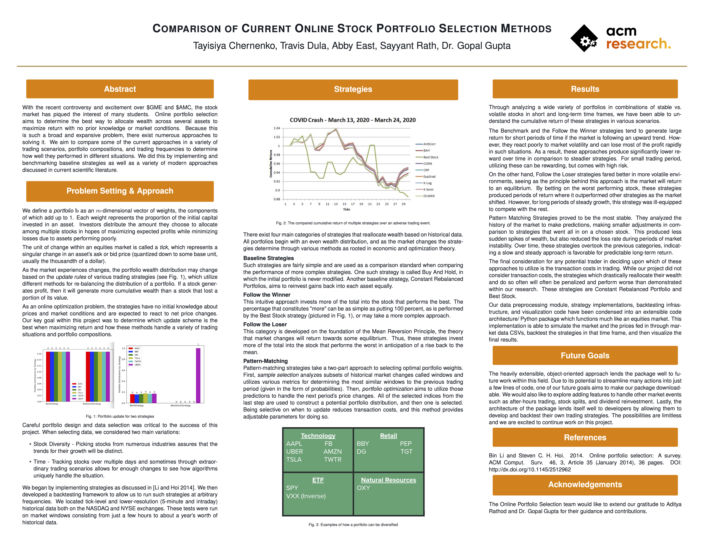
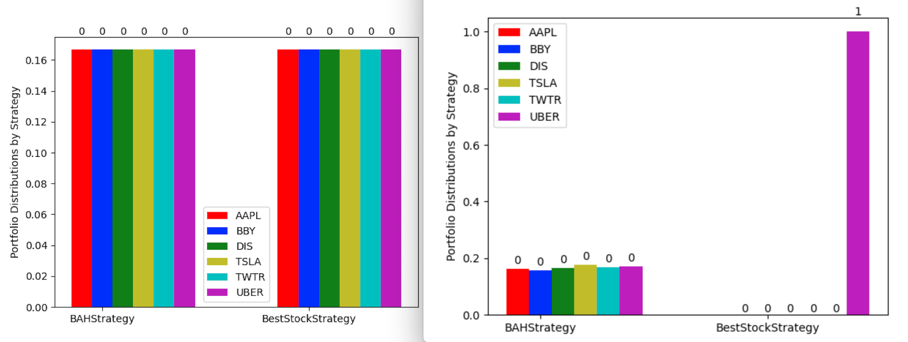
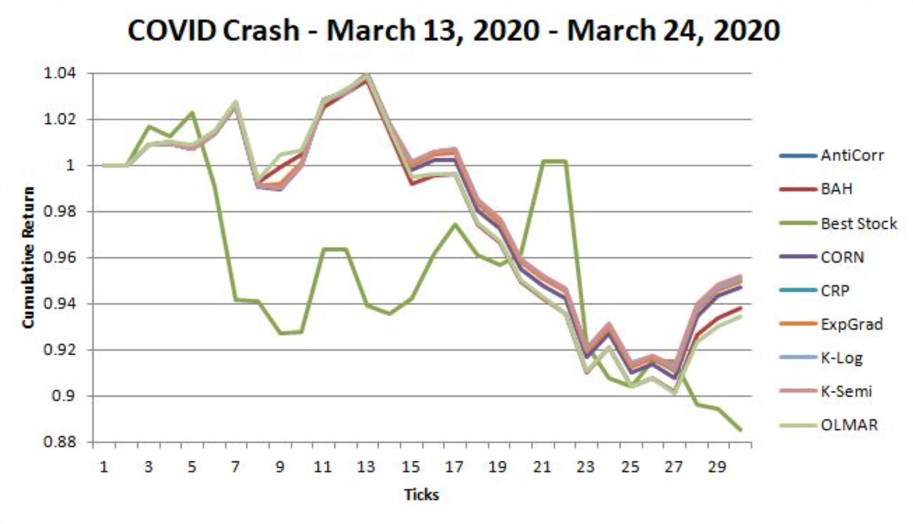
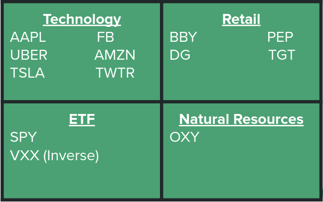

# Comparison of Current Online Portfolio Selection Algorithms

**ACM Research, Spring 2021**

---

 

## Table of Contents
- [Table of Contents](#table-of-contents)
- [Background](#background)
- [Problem Setting & Approach](#problem-setting--approach)
- [Strategies](#strategies)
  - [Baseline Strategies](#baseline-strategies)
  - [Follow the Winner](#follow-the-winner)
  - [Follow the Loser](#follow-the-loser)
  - [Pattern-Matching](#pattern-matching)
- [Results](#results)
- [Future Work](#future-work)
- [References](#references)
- [Project Timeline & Build Night Agendas](#project-timeline--build-night-agendas)
- [Development Instructions](#development-instructions)
- [Package Installation Instructions](#package-installation-instructions)
- [Contributors](#contributors)

## Background

With the recent controversy and excitement over $GME and $AMC, the stock market has piqued the
interest of many students. Online portfolio selection aims to determine the best way to allocate
wealth across several assets to maximize return with no prior knowledge or market conditions.
Because this is such a broad and expansive problem, there exist numerous approaches to solving it.
We aim to compare some of the current approaches in a variety of trading scenarios, portfolio
compositions, and trading frequencies to determine how well they performed in different situations.
We did this by implementing and benchmarking baseline strategies as well as a variety of modern
approaches discussed in current scientific literature.

## Problem Setting & Approach

We define a _portfolio_ **b** as an _m_-dimensional vector of weights, the components of which add
up to 1. Each weight represents the proportion of the initial capital invested in an asset.
Investors distribute the amount they choose to allocate among multiple stocks in hopes of maximizing
expected profits while minimizing losses due to assets performing poorly.

The unit of change within an equities market is called a _tick_, which represents a singular change
in an asset's ask or bid price (quantized down to some base unit, usually the thousandth of a
dollar).

As the market experiences changes, the portfolio wealth distribution may change based on the _update
rules_ of various trading strategies (see below), which utilize different methods for re-balancing
the distribution of a portfolio. If a stock generates profit, then it will generate more cumulative
wealth than a stock that lost a portion of its value.

As an online optimization problem, the strategies have no initial knowledge about prices and market
conditions and are expected to react to net price changes. Our key goal within this project was to
determine which update scheme is the best when maximizing return and how these methods handle a
variety of trading situations and portfolio compositions.

<b>Figure 1</b>: Portfolio update for two strategies

Careful portfolio design and data selection was critical to the success of this project. When
selecting data, we considered two main variations:

- Stock Diversity: Picking stocks from numerous industries assures that the trends for their growth
will be distinct.
- Time: Tracking stocks over multiple days and sometimes through extraordinary trading scenarios
allows for enough changes to see how algorithms uniquely handle the situation.
     
We began by implementing strategies as discussed in [Li and Hoi 2014]. We then developed a
backtesting framework to allow us to run such strategies at arbitrary frequencies. We located
tick-level and lower-resolution (5-minute and intraday) historical data both on the NASDAQ and NYSE
exchanges. These tests were run on market windows consisting from just a few hours to about a year's
worth of historical data.

## Strategies
There exist four main categories of strategies that reallocate wealth based on historical data. All
portfolios begin with an even wealth distribution, and as the market changes the strategies
determine through various methods as rooted in economic and optimization theory.

### Baseline Strategies
Such strategies are fairly simple and are used as a comparison standard when comparing the
performance of more complex strategies. One such strategy is called Buy And Hold, in which the
initial portfolio is never modified. Another baseline strategy, Constant Rebalanced Portfolios, aims
to reinvest gains back into each asset equally.

### Follow the Winner
This intuitive approach invests more of the total into the stock that performs the best. The
percentage that constitutes "more" can be as simple as putting 100 percent, as is performed by the
Best Stock strategy (pictured in Fig. 1), or may take a more complex approach.

### Follow the Loser
This category is developed on the foundation of the Mean Reversion Principle, the theory that market
changes will return towards some equilibrium. Thus, these strategies invest more of the total into
the stock that performs the worst in anticipation of a rise back to the mean.

### Pattern-Matching
Pattern-matching strategies take a two-part approach to selecting optimal portfolio weights. First,
_sample selection_ analyzes subsets of historical market changes called windows and utilizes various
metrics for determining the most similar windows to the previous trading period (given in the form
of probabilities). Then, _portfolio optimization_ aims to utilize those predictions to handle the
next period's price changes. All of the selected indices from the last step are used to construct a
potential portfolio distribution, and then one is selected. Being selective on when to update
reduces transaction costs, and this method provides adjustable parameters for doing so.

<b>Figure 2</b>: The compared cumulative return of multiple strategies over an adverse trading event.

## Results
Through analyzing a wide variety of portfolios in combinations of stable vs.  volatile stocks in
short and long-term time frames, we have been able to understand the cumulative return of these
strategies in various scenarios.

<b>Figure 3</b>: Examples of how a portfolio can be diversified.

    
The Benchmark and the Follow the Winner strategies tend to generate large return for short periods
of time if the market is following an upward trend. However, they react poorly to market volatility
and can lose most of the profit rapidly in such situations. As a result, these approaches produce
significantly lower reward over time in comparison to steadier strategies. For small trading period,
utilizing these can be rewarding, but comes with high risk.
    
On the other hand, Follow the Loser strategies fared better in more volatile environments, seeing as
the principle behind this approach is the market will return to an equilibrium. By betting on the
worst performing stock, these strategies produced periods of return where it outperformed other
strategies as the market shifted. However, for long periods of steady growth, this strategy was
ill-equipped to compete with the rest. 
    
Pattern Matching Strategies proved to be the most stable. They analyzed the history of the market to
make predictions, making smaller adjustments in comparison to strategies that went all in on a
chosen stock. This produced less sudden spikes of wealth, but also reduced the loss rate during
periods of market instability. Over time, these strategies overtook the previous categories,
indicating a slow and steady approach is favorable for predictable long-term return.
    
The final consideration for any potential trader in deciding upon which of these approaches to
utilize is the transaction costs in trading. While our project did not consider transaction costs,
the strategies which drastically reallocate their wealth and do so often will often be penalized and
perform worse than demonstrated within our research. These strategies are Constant Rebalanced
Portfolio and Best Stock.
    
Our data preprocessing module, strategy implementations, backtesting infrastructure, and
visualization code have been condensed into an extensible code architecture/Python package which
functions much like an equities market.  This implementation is able to simulate the market and the
prices fed in through market data CSVs, backtest the strategies in that time frame, and then
visualize the final results. 

## Future Work
The heavily extensible, object-oriented approach lends the package well to future work within this
field. Due to its potential to streamline many actions into just a few lines of code, one of our
future goals aims to make our package downloadable. We would also like to explore adding features to
handle other market events such as after-hours trading, stock splits, and dividend reinvestment.
Lastly, the architecture of the package lends itself well to developers by allowing them to develop
and backtest their own trading strategies. The possibilities are limitless and we are excited to
continue work on this project.

## References
Bin Li and Steven C. H. Hoi. 2014. Online portfolio selection: A survey. ACM Comput. Surv. 46, 3, Article 35 (January 2014), 36 pages. DOI: http://dx.doi.org/10.1145/2512962

## Project Timeline & Build Night Agendas

Available [here](timeline/README.md).

## Development Instructions

Available [here](DEVELOPMENT.md).

## Package Installation Instructions

- Clone the source code for the library: `git clone https://github.com/ACM-Research/online-portfolio-selection.git`
- Run `pip install -r ./requirements.txt`
- Run `pip install -e .`

## Contributors

- [Tayisiya Chernenko](https://github.com/TayisiyaChernenko)
- [Travis Dula](https://github.com/travisdula)
- [Abby East](https://github.com/eastabby)
- [Sayyant Rath](https://github.com/SayyantRath)
- [Aditya Rathod](https://github.com/adityarathod) - Research Lead
- [Dr. Gopal Gupta](https://utdallas.edu/~gupta) - Faculty Advisor
